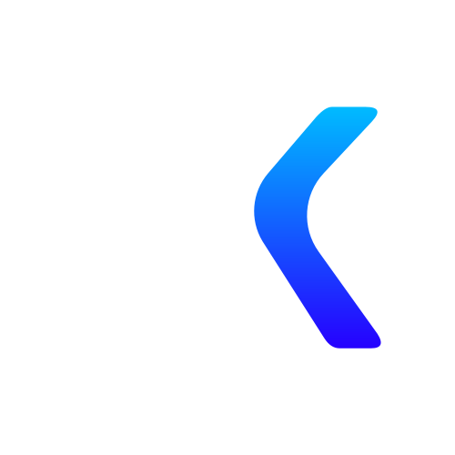

<div align="center">



# Ashok Kumar Portfolio

### 🚀 Modern Developer Portfolio & Engineering Showcase

A futuristic personal portfolio built with **React**, **TypeScript**, **Vite**, and **Tailwind CSS** to showcase professional experience, engineering projects, technical expertise, and product development journey. The portfolio emphasizes clean architecture, immersive user experience, and high-performance web technologies.

<p>


</p>

</div>

---

# 📖 Overview

The **Ashok Kumar Portfolio** is a modern, interactive portfolio website designed to present professional experience, software engineering expertise, freelance work, and product development projects in an engaging and structured format.

Rather than functioning as a simple resume website, the portfolio serves as an engineering showcase that demonstrates technical skills, architecture thinking, product development experience, and problem-solving capabilities. Every section is carefully designed to provide recruiters, clients, and collaborators with a clear understanding of my development journey and the systems I have built.

The website follows a modular architecture with reusable components, smooth animations, responsive layouts, and a futuristic visual design while maintaining excellent performance and accessibility.

---

# 🎯 Project Goals

The portfolio is designed to:

- Showcase professional experience and technical skills.
- Present engineering projects with detailed case studies.
- Highlight product development and freelance work.
- Demonstrate frontend engineering capabilities.
- Create an engaging and memorable user experience.
- Provide recruiters and clients with a centralized professional profile.

---

# ✨ Core Features

## 🏠 Hero Section

A modern landing section introducing the developer.

Features include:

- Animated Introduction
- Professional Summary
- Dynamic Role Highlights
- Social Media Links
- Resume Download
- Call-to-Action Buttons

---

## 👨‍💻 About Me

Comprehensive professional introduction.

Includes:

- Career Journey
- Professional Philosophy
- Technical Expertise
- Personal Values
- Development Approach

---

## 💼 Experience

Professional experience timeline.

Displays:

- Company Experience
- Freelance Projects
- Product Development
- Responsibilities
- Technologies Used

---

## 🚀 Projects

Detailed showcase of engineering projects.

Includes:

- Featured Projects
- Project Descriptions
- Technologies
- Architecture Highlights
- Live Demo Links
- GitHub Repositories
- Screenshots
- Project Timeline

---

## 🛠 Technical Skills

Categorized technology stack.

Sections:

- Programming Languages
- Frontend Technologies
- Backend Technologies
- Databases
- Cloud & DevOps
- Tools & Platforms

---

## 📜 Certifications & Achievements

Highlights:

- Professional Certifications
- Technical Achievements
- Learning Journey
- Product Milestones

---

## 📄 Resume

Professional resume section.

Features:

- Resume Preview
- Download Resume
- ATS-Friendly Resume
- Career Summary

---

## 📞 Contact

Connect with recruiters and clients.

Includes:

- Contact Form
- Email
- LinkedIn
- GitHub
- WhatsApp
- Location

---

# 🎨 User Experience

The portfolio combines modern UI with futuristic aesthetics.

Design principles:

- Minimal Interface
- Glassmorphism Effects
- Smooth Animations
- Interactive Components
- Dark Theme
- Responsive Layout
- Accessibility First

---

# 📱 Responsive Design

Optimized for all devices.

Supported platforms:

- Desktop
- Laptop
- Tablet
- Mobile

The layout automatically adapts to different screen sizes while maintaining usability and visual consistency.

---

# 🏗 Application Architecture

The project follows a scalable component-based architecture.

```
Portfolio Website
        │
        ▼
React Router
        │
        ▼
Pages
        │
 ┌──────┼──────────────┐
 │      │              │
 ▼      ▼              ▼
Hero  Projects      Contact
 │
 ▼
Shared Components
 │
 ▼
Assets & Configuration
```

---

# 🛠 Technology Stack

| Category | Technology |
|----------|------------|
| Framework | React |
| Language | TypeScript |
| Build Tool | Vite |
| Styling | Tailwind CSS |
| Animations | Framer Motion |
| Icons | Lucide React |
| Routing | React Router |
| State Management | React Hooks |
| Forms | React Hook Form |

---

# 📂 Project Structure

```text
src
│
├── assets
│
├── components
│   ├── hero
│   ├── about
│   ├── experience
│   ├── projects
│   ├── skills
│   ├── certifications
│   ├── contact
│   ├── common
│   └── shared
│
├── layouts
├── pages
├── hooks
├── services
├── data
├── constants
├── types
├── utils
├── styles
├── routes
│
├── App.tsx
└── main.tsx
```

---

# 🌐 Website Sections

```
Landing Page
      │
      ▼
Hero
      │
      ▼
About
      │
      ▼
Experience
      │
      ▼
Projects
      │
      ▼
Skills
      │
      ▼
Achievements
      │
      ▼
Resume
      │
      ▼
Contact
```

---

# 🎨 Design System

The portfolio follows a centralized design system.

Includes:

- Tailwind Design Tokens
- Typography Scale
- Color Palette
- Responsive Breakpoints
- Reusable Components
- Animation Guidelines
- Consistent Spacing

---

# ⚡ Performance Optimization

Implemented optimizations include:

- Code Splitting
- Lazy Loading
- Optimized Images
- Tree Shaking
- Vite Production Build
- Component Memoization
- Asset Optimization

---

# ♿ Accessibility

The portfolio follows accessibility best practices.

Features include:

- Semantic HTML
- Keyboard Navigation
- ARIA Labels
- Focus States
- Color Contrast
- Responsive Typography

---

# 🚀 Getting Started

## Clone Repository

```bash
git clone <repository-url>

cd portfolio
```

---

## Install Dependencies

```bash
npm install
```

---

## Configure Environment

Create an environment file.

```env
VITE_APP_NAME=Ashok Kumar Portfolio

VITE_EMAIL_SERVICE=

VITE_EMAIL_TEMPLATE=
```

---

## Start Development

```bash
npm run dev
```

---

## Production Build

```bash
npm run build
```

---

## Preview Build

```bash
npm run preview
```

---

# 📜 Available Scripts

| Command | Description |
|----------|-------------|
| npm run dev | Start development server |
| npm run build | Production build |
| npm run preview | Preview production build |
| npm run lint | Run ESLint |
| npm run format | Format source code |

---

# 📋 Development Guidelines

### Code Quality

- Write modular, reusable components.
- Keep business logic separate from UI.
- Use TypeScript for type safety.
- Follow consistent naming conventions.
- Maintain a scalable folder structure.

---

### UI Guidelines

- Use Tailwind CSS utility classes.
- Avoid hardcoded values.
- Build reusable components.
- Ensure responsiveness.
- Maintain animation consistency.

---

### Performance

- Lazy load heavy components.
- Optimize assets.
- Minimize bundle size.
- Use efficient rendering patterns.

---

### SEO

The portfolio is optimized for search engines through:

- Semantic HTML
- Meta Tags
- Open Graph Support
- Structured Content
- Fast Loading Performance

---

# 🔮 Roadmap

Planned improvements include:

- Blog & Technical Articles
- Project Case Studies
- Interactive Architecture Diagrams
- AI Assistant Integration
- Theme Customizer
- Multi-language Support
- Analytics Dashboard
- Visitor Statistics
- Progressive Web App (PWA)
- CMS Integration

---

# 🤝 Contributing

Although this is a personal portfolio, suggestions and improvements are always welcome.

If you would like to contribute:

1. Fork the repository.
2. Create a feature branch.
3. Implement your improvements.
4. Test your changes.
5. Submit a Pull Request.

---

# 📄 License

This project is released for educational and portfolio purposes.

The source code may not be redistributed commercially without permission.

---

<div align="center">

### Built with ❤️ using React, TypeScript & Tailwind CSS

**Ashok Kumar Portfolio**

Modern • Responsive • Interactive • Engineering Focused

</div>
